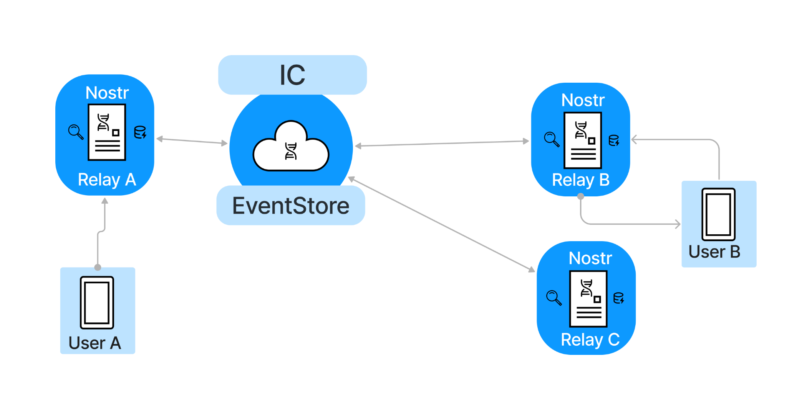

# Replicatr Architecture

## IC Eventstore ##
The `replicatr` IC (Internet Computer) canister stores all posts across the relay cluster with the event-id as the primary key.

##   Cache  
Since the `layer 2` eventstore stores all of the posts, the relays are afforded more flexibility on what they need to store. Furthermore, by enabling relays to share a `layer 2` event store, the relay functions as a fast cache that can deliver freshly
published events quickly to users. By enabling multiple relays to deliver this data, a relay cluster can cope
with very large numbers of users, while keeping users data connected between the relays, serving to distribute the load
of the work of serving and storing events.

The individual relays have a Nostr-specific storage management feature that allows the limitation of storage usage to the confines of
what the relay operator has provisioned for this purpose, with configurable parameters of garbage collection frequency 
and high and low water marks - the high water mark is the trigger size, and the low is the target that each garbage
collection run will cut the storage usage back down to. Events have last access time records and the oldest ones are
pruned first.

If used with a `layer 2` eventstore like the Internet Computer Protocol canister, instead of deleting the whole event
data, only the event data itself is removed, and the search indexes remain, and are able to fill up the space between
the high water mark and the database size limit. These are also pruned by age once the total size of the indices exceeds
the headroom between the high water mark and the limit.

##    Index     
Relays also implement Nostr-specific prefix indexing for efficient querying with the following properties:
1. **Composite indexing** - Prefixes are constructed using multiple aspects of the data to efficiently facilitate multidimensional queries.
2. **Range indexing** -  Date prefixes are ordered such that locating the start of the range and iteration through the range is quick and avoids scanning unrelated data
3. **Sparse indexing** - As prefix keys are only a few bytes each and stored with 'nil' values, the indexing system overall is very lightweight and memory efficient"

## Putting It All Together: The Relay Search-Engine Model ##
Each relay is equipped with a sophisticated indexing system designed for swift querying, coupled with a robust caching mechanism that enhances performance while minimizing disk usage. Essentially, the relay functions as an optimized search engine for Nostr, swiftly generating a list of event IDs in response to each query. These event IDs are then transmitted to the IC Datastore, where content retrieval is further streamlined, as the event IDs serve as the primary keys within the datastore.

## Synchronisation of Relay Data

With multiple relays sharing a network connected event store, such as the Internet Computer implementation found in this
repository, the relays check every 5 seconds (a configurable frequency) for the last 15 seconds of events that have been
added to the `layer 2` event store.

This enables the several relays to be continually updated so messages and posts on one can be interacted with by users
connected to other relays in the cluster. This synchronization is fast enough to carry instant messages as well as
general forum posts.

Potentially in future the canisters could keep request filters open and when new events arrive, actively push the events
back to the other relays in the cluster, however this is more complex and raises the processing and memory requirements,
and may not reduce latency by very much, thus it is not implemented in the initial version.
