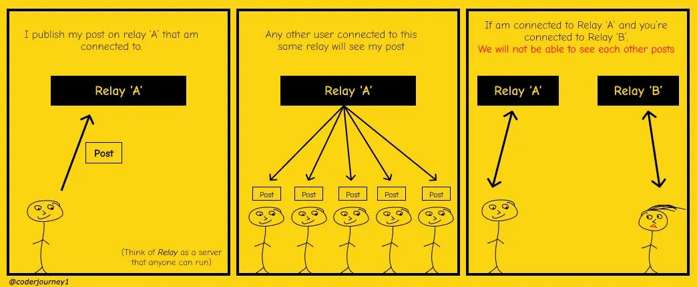

# The Challenge: Nostr's Data Inconsistencies
Nostr's rapid rise in popularity highlights its potential for a paradigm shift in social media. However, its current reliance on a scattered network of disjoint relays creates a major challenge: data inconsistency. Here's how this impacts users:

>The image shows Nostr's relay challenge:  If two users upload their individual posts to different Nostr relays, then the two users might not be able to see each other’s posts. In addition to data inconsistencies across the network, if a user's post on Relay 'A' becomes popular, it leads to a usage spike and potential bottlenecks on 'A', while Relay 'B' remains underutilized

## Fragmented Network
Nostr relays operate independently, and there's no guaranteed synchronization between them. This means users connected to different relays may not see the same content, especially posts from users subscribed to different relays. This creates a fractured user experience and hinders the network's ability to function as a cohesive social platform.

## Bottlenecks 
Nostr's demand-driven approach can overload specific relays serving popular content, impacting performance and potentially leading to data inconsistencies across the network.

## Missed Connections
Due to data inconsistency, users might miss out on important updates, discussions, or events happening within their Nostr communities. This can be frustrating and lead to a sense of isolation within the broader Nostr ecosystem.

## Unreliable Synchronization
Some existing [relays](https://github.com/hoytech/strfry) use synchronization methods like [negentropy](https://github.com/hoytech/negentropy) which are slow, resource-intensive and unreliable, leading to data inconsistencies, gaps, and longer delays to the replication of the most frequently requested data.
